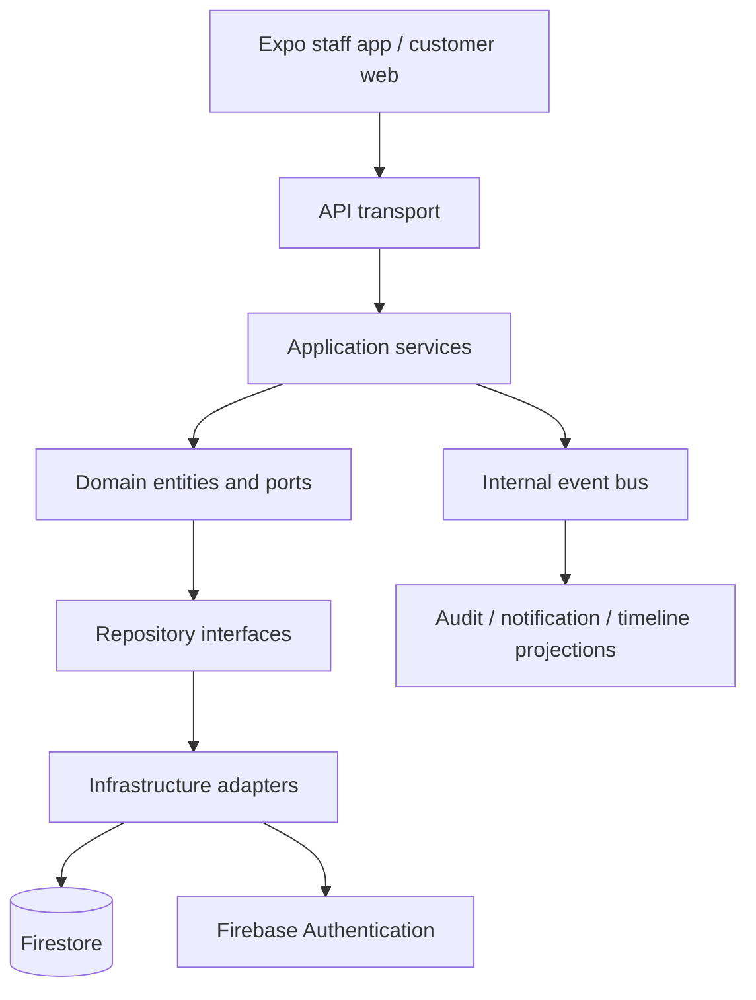
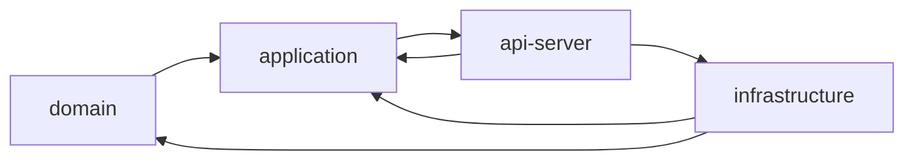
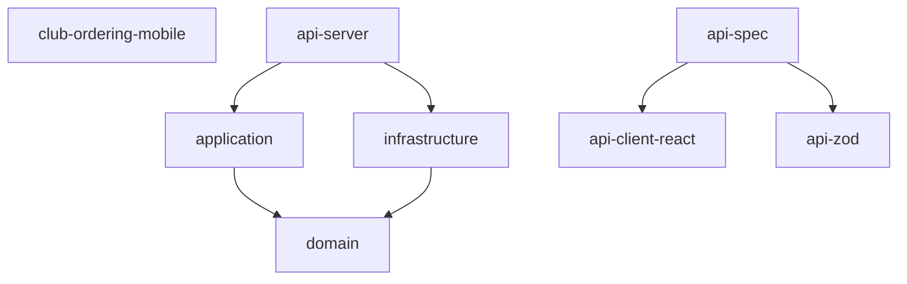
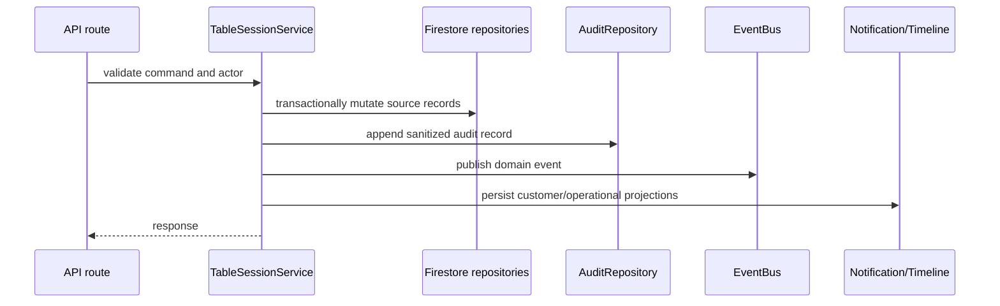

# LoungeOS Architecture Reference

LoungeOS is organized as a tenant-scoped Clean Architecture system:

The application and domain layers do not import Firebase. Firebase Admin is
created only by the infrastructure composition root. There is no alternate
database or in-memory runtime fallback.

## Layer dependency diagram

Dependencies point inward toward contracts. UI code calls API/application
boundaries and never writes Firestore directly.

## Workspace dependency diagram

## Service interaction

## Infrastructure hardening principles

- Firestore is the authoritative persistence provider.
- All tenant-owned paths are scoped below `clubs/{clubId}`.
- Audit data is append-only and sanitized.
- Notifications and timelines are projections, not operational truth.
- Version checks are transactional where repository support is available.
- Soft-deleted records are ignored by default.
- Realtime subscriptions are read projections and cannot mutate source state.
- Offline synchronization carries an expected version for conflict detection.
- Secret values and customer tokens are excluded from audit metadata.
