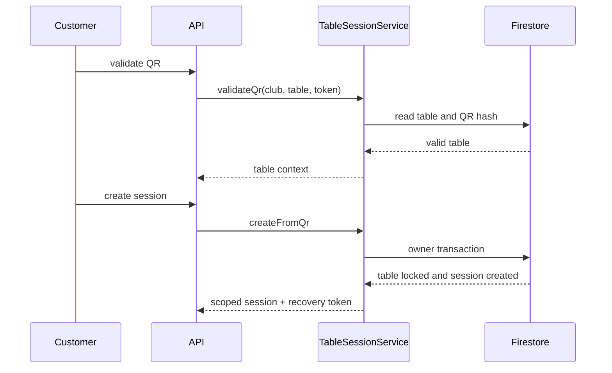
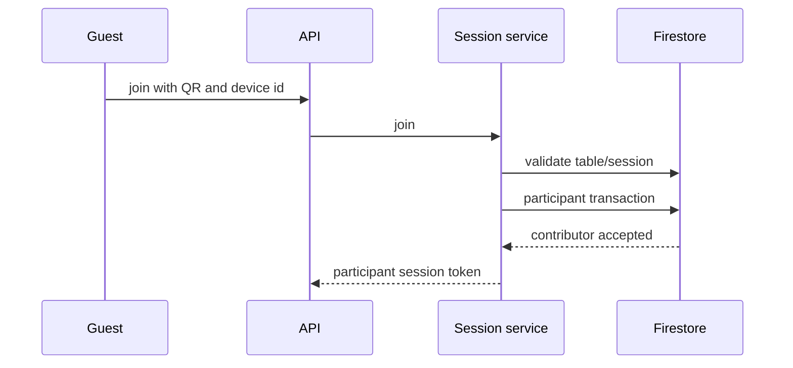
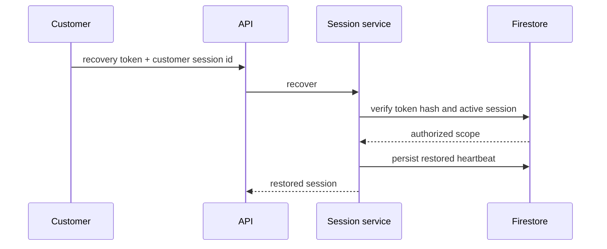
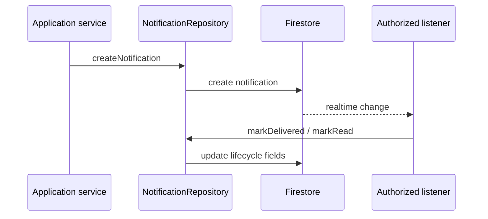
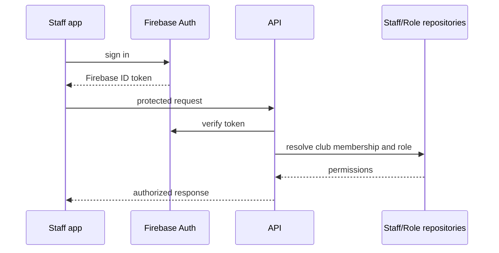
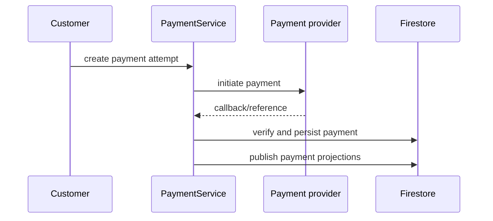

# LoungeOS Sequence Diagrams

## Customer scans QR and opens a session



## Guest joins an existing session



## Session recovery



## Notification flow



## Staff authentication flow



## Payment lifecycle



## Order lifecycle

```mermaid
sequenceDiagram
  participant Customer
  participant OrderService
  participant Firestore
  participant Station as Preparation station
  Customer->>OrderService: submit order
  OrderService->>Firestore: validate menu and stock
  OrderService->>Firestore: create order and tickets
  Firestore-->>Station: realtime ticket
  Station->>Firestore: update preparation state
