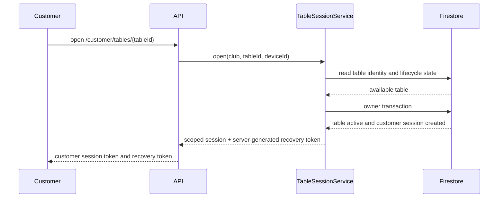
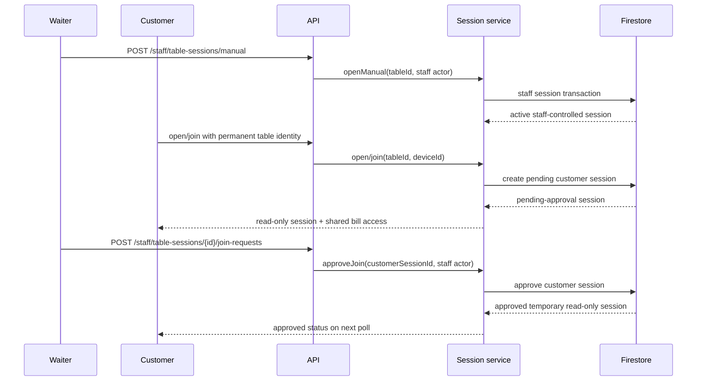
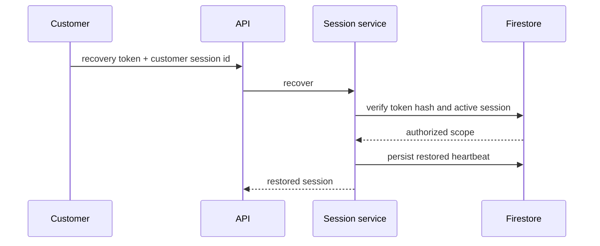
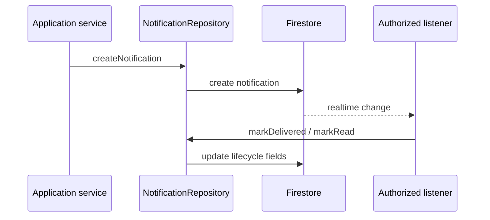
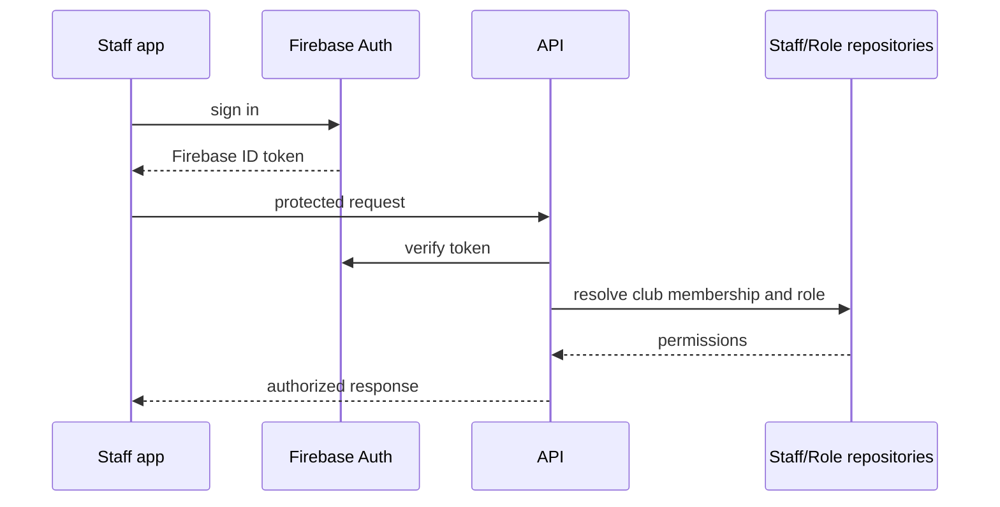
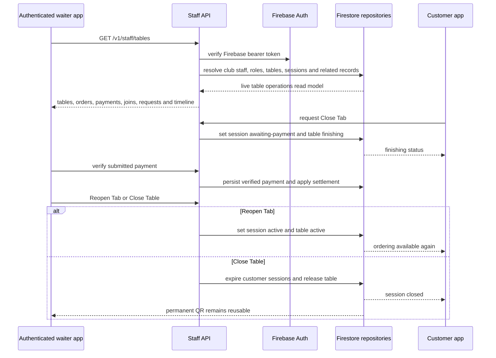
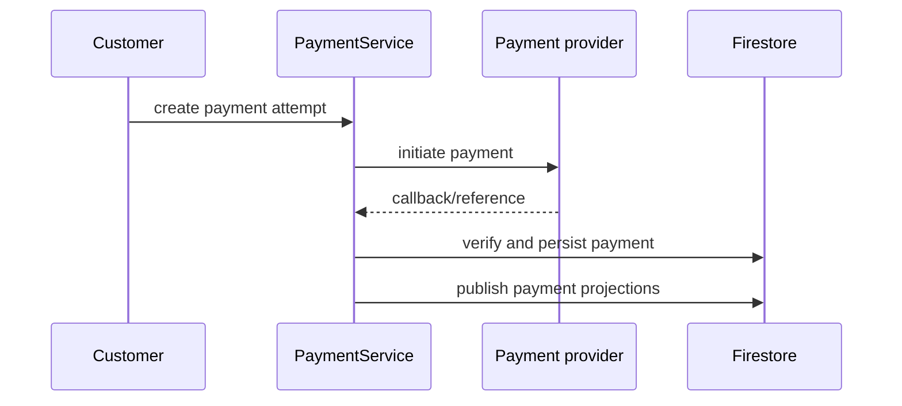

# LoungeOS Sequence Diagrams

## Customer scans QR and opens a session



## Waiter opens a manual table and approves a customer



## Permanent QR reuse after a turnover

```mermaid
sequenceDiagram
  participant C as Customer
  participant API as API
  participant S as Session service
  participant F as Firestore
  C->>API: scan permanent QR containing clubId + tableId
  API->>S: open(tableId, deviceId)
  S->>F: read current table lifecycle
  alt table available
    S->>F: create customer-owned active session
  else table active
    S->>F: reject ordinary new owner join or create pending manual join
  else table finishing
    S-->>API: reject while waiter completes closure
  end
  S-->>C: scoped status and access level
  Note over C,F: QR identity is stable; no QR secret is required for canonical authorization.
```

## Pay Now on an active waiter-controlled table

```mermaid
sequenceDiagram
  participant W as Waiter
  participant C as Customer
  participant API as API
  participant S as Session service
  participant F as Firestore
  C->>API: submit cash or till payment
  API->>S: submitPayment(customer actor)
  S->>F: create pending payment for current running balance
  W->>API: verify payment
  API->>S: verifyPayment(staff actor)
  S->>F: mark payment verified and applied to running cycle
  S->>F: reset runningTotalMinor; keep session active
  F-->>C: next poll shows zero current balance and active table
  Note over C,F: Historical applied payments remain excluded from later Pay Now cycles.
```

## Session recovery



## Notification flow



## Staff authentication flow



## Waiter operations and finishing queue



## Payment lifecycle



## Order lifecycle

```mermaid
sequenceDiagram
  participant Customer
  participant OrderService
  participant Firestore
  participant Station as Preparation station
  Customer->>OrderService: submit order
  OrderService->>Firestore: validate menu and stock
  OrderService->>Firestore: create order and tickets
  Firestore-->>Station: realtime ticket
  Station->>Firestore: update preparation state
