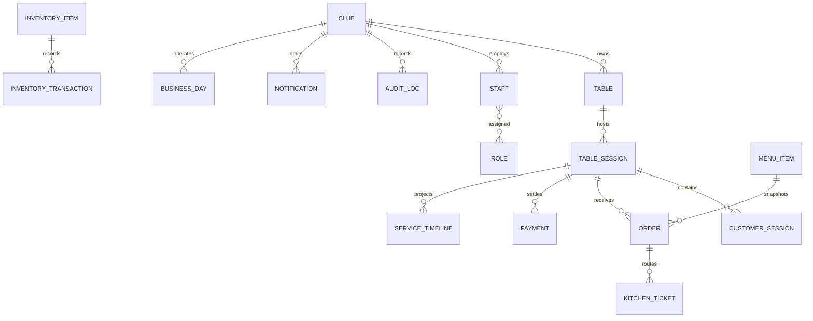

# Firestore Entity Relationships

All entities are tenant-scoped through `clubId`. Operational source records
remain separate from projections such as notifications, service timeline,
activity feed, and analytics facts.

## Relationships

- A table has at most one active table session.
- A table session has one owner customer session and zero or more participants.
- Orders, payments, songs, and service events reference the table session.
- Audit logs reference the actor and mutated resource without replacing it.
- Notifications target a staff role, staff member, or customer session.
- Offline queue items reference a resource type/id and expected version.
